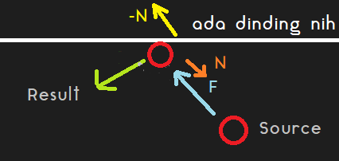
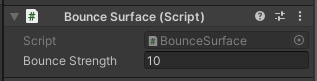

## F. Penambahan Kecepatan Bola

Untuk membuat game Pong ini lebih menantang, kita akan tambahkan fitur untuk menambah kecepatan bola ketika menabrak paddle dan dinding.

1. Pada folder Scripts buat script baru dengan nama `BounceSurface`.


2. Buka script tersebut dengan kode editor anda.

3. Disini kita akan tambahkan method `void OnCollisionEnter2D()` yang menggunakan `Collision2D` sebagai parameternya. Method ini akan dipanggil secara otomatis oleh Unity ketika object dengan component ini menerima collision atau tabrakan dari object lain.

```cs
public class BounceSurface : MonoBehaviour {
    public float bounceStrength;

    private void OnCollisionEnter2D(Collision2D collision) {
        Ball ball = collision.gameObject.GetComponent<Ball>();
        if (ball != null)
        {
            Vector2 normal = collision.GetContact(0).normal;
            ball.AddForce(-normal * this.bounceStrength);
        }
    }
}
```

FYI : `OnCollisionEnter2D` hanya dapat ditrigger oleh object yang memiliki `Physics2D` yaitu object dengan tipe physics 2D, sama halnya dengan method `OnCollisionEnter` yang hanya dapat menerima `Physics` yaitu object dengan tipe physics 3D.

4. Karena tujuan kita menambahkan `OnCollisionEnter2D` adalah untuk mempercepat bola. Maka kita akan menambahkan force atau gaya pada bola tersebut saat bola tersebut menabrak dinding.

Lalu lengkapi class BounceSurface dengan script berikut ini.

```cs
public class BounceSurface : MonoBehaviour {
    public float bounceStrength;

    private void OnCollisionEnter2D(Collision2D collision) {
        Ball ball = collision.gameObject.GetComponent<Ball>();
        if (ball != null)
        {
            Vector2 normal = collision.GetContact(0).normal;
        }
    }
}
```

Pada code diatas kita tambahkan variable `bounceStrength` yang merupakan variable besar gaya yang akan ditambahkan ketika terjadi collision.

Kita lakukan `GetComponent<Ball>()` untuk mendapatkan component `Ball` dari benda yang menabrak dinding (bola) yang telah kita buat sebelumnya. Kemudian kita check, jika `ball` tidak null tandanya benda yang menabrak adalah bola bukan paddle atau object lainnya.

Baru kita ambil negatif gaya normal (searah dengan gaya awal) dari result collision tadi (maaf kalo ada fisika nya h3h3). Agar kita dapat menambahkan gaya ke arah pantulan bola.



5. Setelah gaya normal didapat, selanjutnya adalah menambahkan gaya tersebut pada bola nya. Oleh karena itu kita edit pada script `Ball`. Kita tambahkan method baru yaitu `AddForce`.

```cs
public class Ball : MonoBehaviour {

    /*
        Banyak script
    */

    public void AddForce(Vector2 force)
    {
        this.rigidbody.AddForce(force);
    }
}
```

Mungkin beberapa dari kalian tau kenapa kok kita bikin fungsi `AddForce()`, padahal kan bisa semudah ambil dari `ball.rigidbody.AddForce(force)`.

Alasannya adalah biar ter-encapsulate jadi gaperlu ekspos `rigidbody` dari `Ball` melainkan bikin fungsi baru. Selengkapnya ada di kelas PBO nanti h3h3.

6. Karena telah ditambahkan fungsi `AddForce` pada ball, selanjutnya adalah tinggal manggil fungsi itu dari `BounceSurface` tadi.

```cs
public class BounceSurface : MonoBehaviour {
    public float bounceStrength;

    private void OnCollisionEnter2D(Collision2D collision) {
        Ball ball = collision.gameObject.GetComponent<Ball>();
        if (ball != null)
        {
            Vector2 normal = collision.GetContact(0).normal;

            // Ini
            ball.AddForce(-normal * this.bounceStrength);
        }
    }
}
```

7. Balik ke scene, kita tambahkan component `BounceSurface` ke masing - masing object yang akan memantulkan bola (Top Wall, Bottom Wall, Player Paddle dan Computer Paddle).

Bounce Surface pada Top Wall dan Bottom Wall


Bounce Surface pada Player Paddle dan Computer Paddle



## G. Penambahan Fitur Score

## H. Penambahan UI

## I. Pembersihan Assets