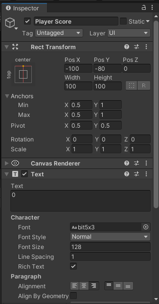

# TutorLBE2021


## Preface
Asset yang digunakan pada game ada pada folder `Assets` pada Repository ini. Meskipun tanpa menggunakan `Assets` juga masih dapat mengikuti step - step nya.

Kalian juga boleh clone Repository ini buat download Project Unity nya. Project Unity ada di folder `PongProject`. Setelah di download bisa langusng di buka di Unity Editor kalian. (tapi nanti aja setelah pertemuan, sekarang sebisa mungkin ngikuti mas/mbak nya yaa)

## Pengertian Game Engine
Unity adalah cross-platform game engine dimana Unity adalah berfungsi sebagai aplikasi "editor" untuk pengembangan game (Semacam halnya Photoshop adalah aplikasi editor untuk manipulasi gambar).

Dalam Unity, dikenal namanya "Unity Project". Unity project secara umumnya dibedakan menjadi 2 yaitu Project 3D dan 2D. Dalam modul ini kita akan lebih lanjut membahas membuat game dalam Unity Project 2D.

## A. Setting Up Project
1. Buka Unity Hub yang telah di download.


2. Pilih New pada pojok kanan atas untuk membuat Project baru.

3. Pilih Template 2D untuk membuat game 2D dan isi **Project Name** untuk Nama Project Game yang ingin dibuat dan **Location** untuk lokasi project yang akan ditempatkan.

## B. Setting Up Scene
1. Pada tampilan awal terdapat panel `Hierarchy`, `SceneView`, `GameView`, `Inspector` dsb yang nanti akan dijelaskan sambil jalannya tutorial.


2. Pertama ubah background color dari camera menjadi hitam (Select camera lalu ubah background color dari inspector)


3. Lalu buat GameObject baru lalu ubah namanya menjadi `Ball` (dengan klik kanan pada `Hierarchy` dan mengikuti seperti di gambar)


- `Hierarchy` atau `Hierarchy Window` mengandung dan menampilkan semua GameObject yang berhubungan dalam Scene yang sedang dikerjakan. GameObject seperti camera, lighting ,model 3D, dsb yang digunakan dalam Scene pasti akan tertampil dalam Hierarchy.

4. Lalu kita akan tambahkan Component RigidBody2D pada GameObject Ball.


- `Rigidbody2D` disini berfungsi untuk menerapkan hukum fisika pada GameObject yang kita pasang dan bisa memodifikasi value propertie seperti mass, drag, gravity, dsb pada object tersebut

5. Kita set gravity scale pada ball ke 0 (agar bola tidak jatuh),set angular drag ke 0.05, dan Freeze Z rotation


6. Agar tampilan ball tidak terlalu besar, kita bisa mengecilkan scale dari ball menjadi seperti berikut (ubah dari Transform properties):


7. Tambahkan Component BoxCollider2D pada GameObject Ball.


- `BoxCollider2D` adalah Component yang berfungsi untuk menetapkan batas bagaimana sebuah objek 2D dapat "bertabrakan"/Berinteraksi dengan objek lain (terdapat collider dengan bentuk shape yang lain)

8. Lalu kita akan membuat GameObject bernama `PlayerPaddle` (2D->Sprite->Square). Lalu atur value pada properties Transform seperti berikut:


9. Add Component `RigidBody2D` pada GameObject `PlayerPaddle` dan atur value pada component sebagai berikut:


- `Mass` berfungsi sebagai massa dari suatu rigidbody yang menempel pada GameObject.
- `Angular Drag` berfungsi sebagai drag dari objek yang menyebabkan objek untuk <em>drag</em> yang apabila object tersebut diberi force/collision semakin besar drag maka semakin cepat object tersebut untuk <em>rest</em>.
- `Gravity Scale` sesuai namanya adalah gaya gravitasi yang bekerja. 0 berarti tidak ada gaya gravitasi (ke bawah) yang bekerja.

10. Tambahkan juga Component `BoxCollider2D` pada `PlayerPaddle`.

11. Lalu duplicate GameObject `Player Paddle` (bisa menggunakan Ctrl + D), ganti nama duplicate tersebut menjadi `Computer Paddle`, dan ganti transform object menjadi berikut:


12. Buat 4 wall sebagai pembatas dari objek bola dengan membuat Empty GameObject dan dipasang dengan component `Box Collider 2D`:


Sehingga di hierarchy tercipta object seperti berikut:


Ubahlah scale dari masing masing wall sehingga jika dilihat dari Scene View akan seperti berikut (samakan dengan component `Transform` dan `Box Collider 2D` di inspector sebelah kanan):


Nah kita tau bahwa game Pong mempunyai garis tengah yang membagi daerah kita dengan daerah musuh

1. Pertama download `HalfSquare.jpg` dari repository ini.
2. Taruh file `HalfSquare.jpg` ke dalam folder assets unity yang sedang dikerjakan dan ganti Wrap Mode dan Filter Mode pada Inspector menjadi seperti berikut:


4. Buat Empty GameObject lalu ganti namanya menjadi `Line`


4. Tambahkan component Line Renderer pada objek Line dan modifikasi properties menjadi seperti berikut:


5. Buat material baru dan ubah shadernya menjadi Unlit/Transparent


6. Tambahkan Texture pada material (klik select yang ada di kotak paling kanan) dan pilih `HalfSquare.jpg`


7. Lalu di LineRenderer pad objek Line pilih material yang telah kita setting tadi


8. Sehingga tampilannya akan menjadi seperti ini


## C. Player Paddle

Agar game Pong ini dapat digerakkan dan dimainkan tentunya kita butuh coding setiap GameObject yang diperlukan.

1. Buat 3 Script yang bernama `Paddle.cs`, `PlayerPaddle.cs`, `ComputerPaddle.cs`


2. Karena object `Player Paddle` dan `Computer Paddle`mempunyai karakteristik yang sama yaitu pada game ini adalah kecepatan dari paddle dan adanya component `RigidBody2D` yang akan diakses oleh script pada kedua objek, maka kita buat satu class/script parent bernama `Paddle.cs` yang fungsinya akan inherit karakteristik yang sama tersebut ke kedua class yang mungkin saja memiliki method yang berbeda. 


Prinsip inheritance akan dipakai dalam konsep Pemrograman berbasis objek. Pertama tulis script berikut ke class/script `Paddle.cs`:

```cs
public class Paddle : MonoBehaviour
{
    public float speed = 10.0f;
    protected Rigidbody2D _rigidBody; 

    private void Awake(){
        _rigidBody = GetComponent<Rigidbody2D>();
    }
}
```
- Fungsi `Awake()`berjalan saat scene dijalankan atau saat GameObject aktif (once during the lifetime of the script instance).

Script diatas berfungsi untuk mendapatkan value dari component RigidBody2D dari Object dan set atribute speed (digunakan nanti) dari masing-masing paddle.

3. Lalu kita pasangkan script `PlayerPaddle.cs` ke GameObject `PlayerPaddle` dan modifikasi script didalamnya menjadi seperti berikut:

```cs
public class PlayerPaddle : Paddle
{
    private Vector2 _direction;

    private void Update(){
        if(Input.GetKey(KeyCode.W) || Input.GetKey(KeyCode.UpArrow)){
            _direction = Vector2.up;
        }
        else if(Input.GetKey(KeyCode.S) || Input.GetKey(KeyCode.DownArrow)){
            _direction = Vector2.down;
        } else{
            _direction = Vector2.zero;
        }
    }

    private void FixedUpdate(){
        if(_direction.sqrMagnitude != 0){
            _rigidBody.AddForce(_direction * this.speed);
        }
    }
}
```
`public class PlayerPaddle : Paddle` menandakan script tersebut menurunkan sifat/inheritance dari class/script `Paddle.cs` 
- Fungsi `Update()` akan bekerja setiap frame dalam game tersebut. Sehingga setiap perubahan seperti movement dsb bisa ditaruh pada fungsi ini.
- Fungsi `FixedUpdate()` akan bekerja tiap satuan waktu (bukan frame). Fungsi ini sangat berguna jika menerapkan perubahan yang terkait dengan Physics.

4.Attribute speed karena bersifat `public` maka value nya bisa diatur dari Unity:


5. Sekarang coba tekan play dan coba gerakkan paddle yang telah dipasang scriptnya.


## D. Ball Movement

Nah kita tau kalau game dari pong sendiri itu untuk bolanya sendiri pergerakan nya random (kickoff-nya).
Pertama buat script `Ball.cs` lalu pasangkan component script `Ball` tersebut pada `GameObject` `Ball`. Kemudian kita akan modifikasi script `Ball` menjadi berikut:

1. 
```cs
public class Ball : MonoBehaviour
{
    public float speed = 200.0f;
    private Rigidbody2D _rigidBody;

    private void Awake(){
        _rigidBody = GetComponent<Rigidbody2D>();
    }
    private void Start()
    {
        AddStartingForce();
    }

    public void AddStartingForce()
    {
        float x = Random.value < 0.5f ? -1.0f : 1.0f;
        float y = Random.value < 0.5f ? Random.Range(-1.0f, -0.5f) : Random.Range(0.5f, 1.0f);

        Vector2 direction = new Vector2(x ,y);
        _rigidBody.AddForce(direction * this.speed);
    }
}
```
- Fungsi `Start()` akan dijalankan sama seperti `Awake()` akan dijalankan tepat sekali saat lifetime dari script tersebut namun Fungsi `Awake()` dijalankan tidak peduli script tersebut aktif atau tidak. Sedangkan `Start()` bisa saja tidak dijalankan satu frame dengan `Awake()` karena bisa saja script sedang disabled.

Pada script diatas saat script dijalankan, Fungsi `AddStartingForce()` akan berjalan. Pada fungsi `AddStartingForce()` direction dari ball akan dirandom (Masih ingat ternary operator ?). 

Pada dasarnya line `float x = Random.value < 0.5f ? -1.0f : 1.0f;` berarti: ambil random value, jika value tersebut dibawah 0.5 maka direction x akan bernilai -1, jika tidak maka direction x akan bernilai 1. (Untuk random bola bergerak ke arah kiri atau kanan).

Pada line `float y = Random.value < 0.5f ? Random.Range(-1.0f, -0.5f) : Random.Range(0.5f, 1.0f);` berarti: ambil random value, jika value tersebut dibawah 0.5 maka akan diambil nilai random antar -1 hingga -0.5. Jika tidak, maka diambil random value dari 0.5 hingga 1. (Untuk random angle dari bola).

2. Lalu masukkan value yang didapatkan kedalam variable bertipe `Vector2D` dan kita `AddForce` untuk menggerakkan bola dengan direction yang didapatkan dan speed yang telah ditentukan.

3. Cek apakah bola bergerak dalam Play Mode.


Namun karena belum ditambahkan bouncy material sehingga bola saat collision dengan GameObject tidak memantul.

1. Pertama tambahkan PhysicsMaterial2D pada tab Project:


2. Ubah value dari material menjadi seperti ini:


3. Pasang Material tadi ke RigidBody2D pada GameObject ball dengan drag material tadi ke Properties Material:


4. Cek pergerakan bola dengan Play Mode.

## E. Computer Paddle

Nah agar game pong yang kita buat lebih menantang, maka kita bisa menambahkan script pada GameObject Computer Paddle agar dapat bergerak sendiri

1. Pasang script `ComputerPaddle.cs` pada GameObject Computer Paddle
2. Modifikasi script pada `ComputerPaddle.cs` menjadi seperti berikut:
```cs
public class ComputerPaddle : Paddle
{
    public Rigidbody2D ball;
    private void FixedUpdate()
    {
        //Jika Bola ke arah computer paddle
        if(this.ball.velocity.x > 0.0f){
            //JIka Bola di atas computer paddle
            if(this.ball.position.y > this.transform.position.y){
                _rigidBody.AddForce(Vector2.up * this.speed);
            }
            //JIka Bola di bawah computer paddle
            else if(this.ball.position.y < this.transform.position.y){
                _rigidBody.AddForce(Vector2.down * this.speed);
            }
        }
        else{
           //Kode dibawah akan memposisikan computer paddle ke tengah
           if(this.transform.position.y > 0.0f){
               _rigidBody.AddForce(Vector2.down * this.speed);
           } 
           else if(this.transform.position.y < 0.0f){
               _rigidBody.AddForce(Vector2.up * this.speed);
           }
        }
    }
}
```
3. Pasang GameObject Ball pada script ComputerPaddle (dengan drag GameObject ball ke component script Computer Paddle atau bisa select langsung)


4. Test pergerakan Computer Paddle dengan Play Mode

## F. Penambahan Kecepatan Bola

Untuk membuat game Pong ini lebih menantang, kita akan tambahkan fitur untuk menambah kecepatan bola ketika menabrak paddle dan dinding.

1. Pada folder Scripts buat script baru dengan nama `BounceSurface`.


2. Buka script tersebut dengan kode editor anda.

3. Disini kita akan tambahkan method `void OnCollisionEnter2D()` yang menggunakan `Collision2D` sebagai parameternya. Method ini akan dipanggil secara otomatis oleh Unity ketika object dengan component ini menerima collision atau tabrakan dari object lain.

```cs
public class BounceSurface : MonoBehaviour {
    public float bounceStrength;

    private void OnCollisionEnter2D(Collision2D collision) {
        Ball ball = collision.gameObject.GetComponent<Ball>();
        if (ball != null)
        {
            Vector2 normal = collision.GetContact(0).normal;
            ball.AddForce(-normal * this.bounceStrength);
        }
    }
}
```

FYI : `OnCollisionEnter2D` hanya dapat ditrigger oleh object yang memiliki `Physics2D` yaitu object dengan tipe physics 2D, sama halnya dengan method `OnCollisionEnter` yang hanya dapat menerima `Physics` yaitu object dengan tipe physics 3D.

4. Karena tujuan kita menambahkan `OnCollisionEnter2D` adalah untuk mempercepat bola. Maka kita akan menambahkan force atau gaya pada bola tersebut saat bola tersebut menabrak dinding.

Lalu lengkapi class BounceSurface menjadi script berikut ini.

```cs
public class BounceSurface : MonoBehaviour {
    public float bounceStrength;

    private void OnCollisionEnter2D(Collision2D collision) {
        Ball ball = collision.gameObject.GetComponent<Ball>();
        if (ball != null)
        {
            Vector2 normal = collision.GetContact(0).normal;
        }
    }
}
```

Pada code diatas kita tambahkan variable `bounceStrength` yang merupakan variable besar gaya yang akan ditambahkan ketika terjadi collision.

Kita lakukan `GetComponent<Ball>()` untuk mendapatkan component `Ball` dari benda yang menabrak dinding (bola) yang telah kita buat sebelumnya. Kemudian kita check, jika `ball` tidak null tandanya benda yang menabrak adalah bola bukan paddle atau object lainnya.

Baru kita ambil negatif gaya normal (searah dengan gaya awal) dari result collision tadi (maaf kalo ada fisika nya h3h3). Agar kita dapat menambahkan gaya ke arah pantulan bola.


5. Setelah gaya normal didapat, selanjutnya adalah menambahkan gaya tersebut pada bola nya. Oleh karena itu kita edit pada script `Ball`. Kita tambahkan method baru yaitu `AddForce`.

```cs
public class Ball : MonoBehaviour {

    /*
        Banyak script
    */

    public void AddForce(Vector2 force)
    {
        _rigidBody.AddForce(force);
    }
}
```

Mungkin beberapa dari kalian tau kenapa kok kita bikin fungsi `AddForce()`, padahal kan bisa semudah ambil dari `ball._rigidBody.AddForce(force)`.

Alasannya adalah biar ter-encapsulate jadi gaperlu ekspos `rigidbody` dari `Ball` melainkan bikin fungsi baru. Selengkapnya ada di kelas PBO nanti h3h3.

6. Karena telah ditambahkan fungsi `AddForce` pada ball, selanjutnya adalah tinggal manggil fungsi itu dari `BounceSurface` tadi.

```cs
public class BounceSurface : MonoBehaviour {
    public float bounceStrength;

    private void OnCollisionEnter2D(Collision2D collision) {
        Ball ball = collision.gameObject.GetComponent<Ball>();
        if (ball != null)
        {
            Vector2 normal = collision.GetContact(0).normal;

            // Ini
            ball.AddForce(-normal * this.bounceStrength);
        }
    }
}
```

7. Balik ke scene, kita tambahkan component `BounceSurface` ke masing - masing object yang akan memantulkan bola (Top Wall, Bottom Wall, Player Paddle dan Computer Paddle).

Bounce Surface pada Top Wall dan Bottom Wall


Bounce Surface pada Player Paddle dan Computer Paddle


## G. Penambahan Fitur Score

Fitur score akan kita buat dengan 2 Step. Yang pertama adalah membuat class untuk mendeteksi bahwa ketika suatu paddle tidak berhasil menangkap bola maka score lawan bertambah. Selanjutnya adalah fitur reset posisi paddle ketika ada yang bertambah score.

1. Pertama buatlah script dengan nama `GameManager` pada folder `Scripts`. Dapat dilihat bahwa icon agak berbeda karena nama `GameManager` ini bawaan Unity (GameManager sering ada di pembuatan game). Nama yang lain pun sebenarnya nggak masalah.


2. Lengkapi script `GameManager` dengan kode berikut ini.

```cs
public class GameManager : MonoBehaviour {
    private int playerScore;
    private int computerScore;

    public void PlayerScores(){
        playerScore++;
    }

    public void ComputerScores(){
        computerScore++;
    }
}
```

Pada kode diatas, kita tambahkan `playerScore` dan `computerScore` untuk melakukan track score pada masing - masing pemain. `PlayerScores` akan dipanggil ketika computer kalah dan `ComputerScores` akan dipanggil ketika player kalah.

3. Pada script `Ball` kita tambahkan fungsi baru yaitu `ResetPosition` jadi ketika score bertambah kita akan reset posisi ball ke tengah - tengah;

```cs
public class Ball : MonoBehaviour {

    /*
        Code lain
    */

    public void ResetPosition()
    {
        _rigidBody.velocity = Vector2.zero;
        _rigidBody.position = Vector2.zero;
    }
}
```

4. Pada script `Paddle` tambahkan juga fungsi `ResetPosition` untuk mereset posisi paddle ke tempat awal;

```cs
public class Paddle : MonoBehaviour {

    /*
        Code lain
    */

    public void ResetPosition()
    {
        _rigidBody.velocity = Vector2.zero;
        _rigidBody.position = new Vector2(_rigidBody.position.x, 0.0f);
    }
}
```

5. Kembali pada `GameManager`, tambahkan variable `ball` untuk referensikan ke bola, variable `playerPaddle` dan `computerPaddle` untuk mereferensikan ke paddle masing - masing pemain pemain.

```cs
public class GameManager : MonoBehaviour {
    // Ini
    public Ball ball;

    private int playerScore;
    
    // Ini
    public Paddle playerPaddle;

    private int computerScore;
    
    // dan Ini
    public Paddle computerPaddle;

    public void PlayerScores(){
        playerScore++;
    }

    public void ComputerScores(){
        computerScore++;
    }
}
```

6. Terakhir tambahkan fungsi baru `StartRound` untuk mereset segalanya ke posisi awal.

```cs
public class GameManager : MonoBehaviour {

    public Ball ball;

    private int playerScore;
    public Paddle playerPaddle;

    private int computerScore;
    public Paddle computerPaddle;

    // Fungsi / method baru
    public void StartRound(){
        playerPaddle.ResetPosition();
        computerPaddle.ResetPosition();
        ball.ResetPosition();
        ball.AddStartingForce();
    }

    public void PlayerScores(){
        playerScore++;

        // tambahkan ini
        StartRound();
    }

    public void ComputerScores(){
        computerScore++;

        // tambahkan ini
        StartRound();
    }
}
```

7. Kembali ke Scene, bikin gameObject baru dengan nama `GameManager` (boleh juga nama lain, ini biar jelas aja). Tambahkan component `GameManager` ke gameObject yang dibuat tadi. Setelah itu pasang - pasang variable nya.


8. Setelah semua disiapkan untuk reset dan scoring, sekarang membuat sistem trigger penambahan score nya. Buat script baru dengan nama `ScoringZone`. Script ini mirip dengan script `BounceSurface` yang telah kita buat.

```cs
using UnityEngine;
using UnityEngine.Events;

public class ScoringZone : MonoBehaviour
{
    public UnityEvent scoreTrigger;

    private void OnCollisionEnter2D(Collision2D collision)
    {
        Ball ball = collision.gameObject.GetComponent<Ball>();

        if (ball != null) {
            this.scoreTrigger.Invoke();
        }
    }

}
```

Script diatas kita menggunakan fitur bawaan Unity yaitu `UnityEvent`. Jadi kita bisa mengatur fungsi / method apa yang akan terjadi ketika event tersebut dipanggil / di-invoke melalui Unity.

Script diatas pada dasarnya check collision dari bola, ketika yang ber-collision adalah bola maka Invoke event `scoreTrigger`.

9. Kembali ke Scene, pada gameObject `Left Wall` dan `Right Wall`tambahkan component `ScoringZone`. Pada `Left Wall` drag gameObject `GameMaster` ke field lalu pilih fungsi `ComputerScores`. Ini artinya ketika bola menabrak `Left Wall` maka Player Kalah, sehingga fungsi `ComputerScores` akan dipanggil untuk menambah score computer.


Lakukan hal yang sama tapi berkebalikan pada `Right Wall`.


10. Untuk testing bisa tambahkan `Debug.Log(score)` pada script `GameManager` lalu test play.

## H. Penambahan UI

Agar Pemain bisa tahu score game nya, maka kita akan tambahkan UI score masing - masing pemain menggunakan fitur UI pada Unity.

1. Buat lah gameObject `Canvas`. 


2. Pada gameObject `Canvas` edit konfigurasi componentnya sebagai berikut.


3. Lalu pada `Canvas` tambahkan `Text` lalu beri nama `Player Score`.

Note : `Text` hanya dapat bekerja kalo ada di canvas, jadi pastikan bikin gameObject `Text` dengan cara klik kanan `Canvas` lalu `UI > Text`.


4. Kita perlu edit beberapa konfigurasi dari UI Text nya menjadi seperti ini.



Pada gambar diatas kita ubah anchor nya (yang gambar kotak) menjadi diatas tengah. Lalu Pos X, Pos Y. Tambahkan text "0" agar lebih jelas untuk melihat posisi UI nya. Ubah Font menjadi `bit5x3` dari asset yang disediakan dan ubah Font size menjadi 128. Lalu terakhir ubah alignment nya.

5. Buat gameObject `Text` lagi dari canvas juga, kali ini ubah namanya menjadi `Computer Score`. Lakukan hal yang sama seperti `Player Score`.


6. Kurang lebih tampilan UI akan seperti berikut ini.


7. Pada script `GameManager` tambahkan variable `playerScoreText` dan `computerScoreText`. Namun sebelum itu, tambahkan namespace `UnityEngine.UI` karena kita akan menggunakan class `Text` yang ada pada namespace tersebut.

```cs
using UnityEngine;
using UnityEngine.UI;

public class GameManager : MonoBehaviour
{
    /*
        Variable yang lainnya..
    */

    public Text playerScoreText;
    public Text computerScoreText;
}
```

8. Setelah itu tambahkan fungsi baru untuk melakukan set player dan computer score pada `GameManager`.

```cs
private void SetPlayerScore(int score)
{
    playerScore = score;
    playerScoreText.text = score.ToString();
}

private void SetComputerScore(int score)
{
    computerScore = score;
    computerScoreText.text = score.ToString();
}
```

`playerScoreText.text` merupakan property `text` pada UI `Player Score`. Sama halnya dengan `Computer Score`. Kita akan lakukan update text ini setiap penambahan score terjadi.

9. Karena kita telah menambahkan kedua fungsi diatas, kita perlu modifikasi fungsi `PlayerScores` dan `ComputerScores` agar tidak redundant.

```cs
public void PlayerScores(){
    // ubah dari..
    // playerScore++;
    // menjadi..
    SetPlayerScore(playerScore + 1);

    StartRound();
}

public void ComputerScores(){
    // ubah dari..
    // computerScore++;
    // menjadi..
    SetComputerScore(computerScore + 1);

    StartRound();
}
```

10. Terakhir, kita pasang - pasang variable nya pada `GameManager` lalu coba mainkan gamenya.


## I. Fitur Retry Game

Pada step ini kita akan tambahkan fitur retry game ketika Player menekan tombol `R`.

1. Pada `GameManager` buat fungsi baru dengan nama `NewGame`. Lalu isi dengan code berikut.

```cs
public void NewGame()
{
    SetPlayerScore(0);
    SetComputerScore(0);
    StartRound();
}
```

Dapat dilihat bahwa pada dasarnya `NewGame` mereset score player dan computer menjadi 0, lalu mereset posisi paddle dan bola ke posisi awal.

2. Lalu pada tambahkan juga `Update` kalo belum ada, kalo sudah ada kita modifikasi aja.

```cs
private void Update()
{
    if (Input.GetKeyDown(KeyCode.R)) {
        NewGame();
    }
}
```

`Input` merupakan static class untuk melakukan pengecheck-an input. Pada code diatas maksudnya adalah, ketika tombol `R` di tekan sekali maka akan bernilai `true` sehingga block `NewGame` akan di-eksekusi.

3. Coba mainkan game dan tekan tombol `R`. Kalo berhasil maka score game akan tereset dan posisi kembali ke posisi semula.

## J. Uwu, nice

Selamat game Pong telah berhasil dibuat.

## K. Saran untuk FP

Jika kalian ingin melanjutkan FP dari project ini (kalo mau bikin project lain boleh aja sih :D ) mungkin ini saran-saran dari kami:
- Membuat map baru untuk pong (obstacle).
- Membuat gamenya menjadi 2 player (kontrol W, S) dan (kontrol Up,Down).
- Koin yang jika kena bakal nambah score.
- Menambahkan Main Menu dan Pause Menu (bisa juga di Main Menu opsi vsBot atau PvP).
- Tambahin Sound Effect.
- Bot-nya terlalu OP, coba dilemahin dia h3h3.
- etc.

## Referensi
- [How to make Pong in Unity 🏓💥](https://www.youtube.com/watch?v=AcpaYq0ihaM&ab_channel=Zigurous)
- [Unity Documentation](https://docs.unity3d.com/Manual/index.html)


  
